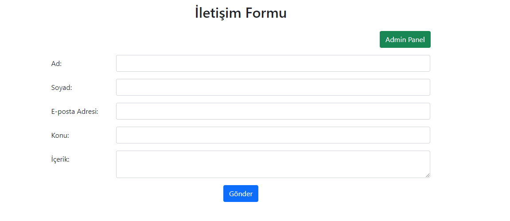
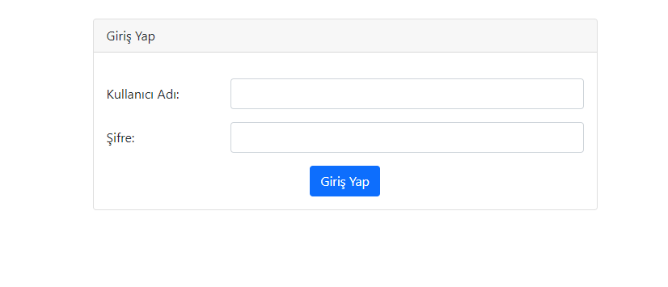
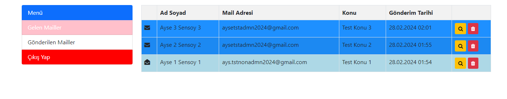
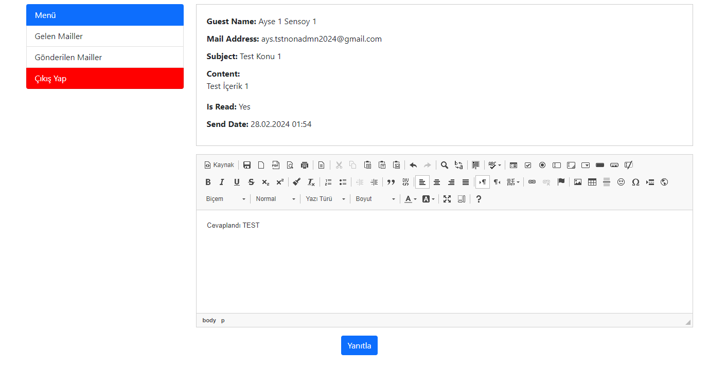
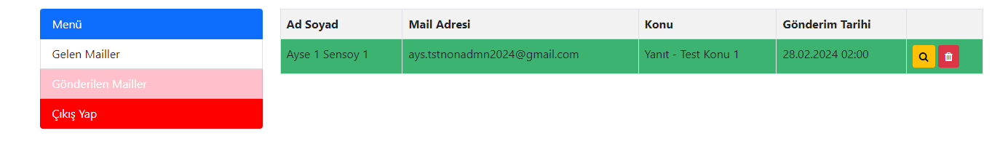

# ContactFormProject
ContactForm Projesi, .NET 7.0 MVC platformu kullanılarak geliştirilmiştir. Veritabanı işlemleri için ayrı bir katman oluşturulmuştur. Bu katmanda, Code First yaklaşımıyla "Mails" adında bir tablo oluşturulmuş ve veritabanı işlemleri için EntityFramework ORM kullanılmıştır.
Ön yüzde, MVC şablonu içerisinde yer alan varsayılan Bootstrap ve jQuery kullanılmıştır. Ayrıca, Font Awesome 4.7.0 kütüphanesi ve CKEditor 4'ten yararlanılmıştır.
İletişim Formu sayfasında, kullanıcılar ekran üzerindeki giriş alanlarını doldurduktan sonra "Gönder" düğmesine bastıklarında, veritabanına bir kayıt eklenmekte ve aynı zamanda yöneticinin appsettings.json dosyasında tanımlı e-posta adresine otomatik bir bildirim e-postası gönderilmektedir. İşlem başarılı/başarısız ise alert olarak bilgi gösterilmektedir. Giriş alanları için validasyonlar eklenmiştir; bunlar boş bırakılamaz ve belirlenen maksimum karakter sayısını aşamaz. Resim 1 ’de iletişim Formunun yer aldığı görsel gösterilmiştir.

Sayfadaki sağ üst köşede bulunan "Admin Panel" butonuna tıklandığında, kullanıcı giriş sayfasına yönlendirilecektir. Bu sayfa, yalnızca yönetici hesabı içindir ve kendisine gelen/giden e-postaları kontrol edebilir. Yönetici hesabının kullanıcı adı ve şifresi appsettings.json dosyasının "LoginParameters" bölümünde bulunmaktadır.
Yönetici doğru şifre ile giriş yaptığında, Session’a bir veri yazılmaktadır ve çıkış yapılıncaya kadar bu parametre oturumda saklanmaktadır. Giriş yapılmadan, yönetici panelindeki
işlemlerin kullanılmasını engellemek için basit bir güvenlik önlemi alınmıştır. Resim 2 ’de admin panele giriş ekranı yer almaktadır.

Giriş yapıldıktan sonra açılan sayfada sol menüde sayfa geçişleri için 2 buton ve oturumdan çıkış yapmak için 1 buton yer almaktadır. Varsayılan olarak, "Gelen Mail Kutusu" açılmaktadır ve bu sayfada yöneticiye gönderilen e-postalar listelenmektedir. Okunmuş ve okunmamış e-postaları ayırt etmek için farklı simgeler ve renk tonları kullanılmıştır. Her e-postanın sağında, ilgili işlemleri gerçekleştirmek için düğmeler bulunmaktadır. Resim 3 ‘te Gelen maillerin listelendiği sayfa görseli yer almaktadır.

Kırmızı düğmeye tıklandığında, silme işlemini onaylamak için bir onay kutusu belirir; eğer onaylanırsa, e-posta yumuşak bir şekilde silinir (veritabanından kalıcı olarak silinmez, "IsDeleted" sütunu true olarak işaretlenir).
Sarı düğmeye tıklandığında, e-posta detay sayfası açılır ve yönetici, sayfanın altındaki editörden e-postayı yanıtlayabilir. Resim 4 ‘ detay sayfası gösterilmiştir.

"Giden Mail Kutusu" sayfasında, yöneticinin gönderdiği e-postaların kayıtları bulunmaktadır. Bu sayfada da detay görüntüleme ve silme işlemleri mevcuttur. Detay düğmesine basıldığında, "Yanıtla" işlemi için editör ve düğme bu sayfaya eklenmemiştir. Resim 5 ‘te Giden maillerin listelendiği sayfa görseli yer almaktadır.

Son olarak, sol menüde en altta bulunan "Çıkış Yap" düğmesine tıklanarak oturum sonlandırılır ve kullanıcı ana sayfaya yönlendirilir. Giriş yapılırken kaydedilen veriler oturumdan silinerek, yönetici sayfalarına giriş engellenir.
Değiştirilebilir parametreler appsettings.json dosyasında tutulmaktadır
• ConnectionString: Veritabanı bağlantı adresi buraya yazılmalıdır.
• LoginParameters > AdminUsername: Yönetici paneline giriş yapmak için kullanıcı adı bilgisi.
• LoginParameters > AdminPassword: Yönetici paneline giriş yapmak için şifre bilgisi.
• EmailParameters > AdminSenderMailAddress: Yönetici hesabı ile e-postalara yanıt vermek için kullanılan e-posta adresi.
• EmailParameters > AdminSenderMailPassword: Yönetici hesabı ile e-postalara yanıt vermek için kullanılan şifre.
• EmailParameters > SenderMailAddress: Ziyaretçilerin "Gönder" butonuna bastığında yöneticiye gönderilen bilgilendirme e-postaları için kullanılan hesabın adresi.
• EmailParameters > SenderMailPassword: Ziyaretçilerin "Gönder" butonuna bastığında yöneticiye gönderilen bilgilendirme e-postaları için kullanılan hesabın şifresi.
• EmailParameters > MailHost: E-posta gönderimi için Host adı (Outlook ile test edilmiştir).
• EmailParameters > MailPort: E-posta gönderimi için Port numarası (Outlook ile test edilmiştir).

Hazırlayan : Ayşe Şensoy
